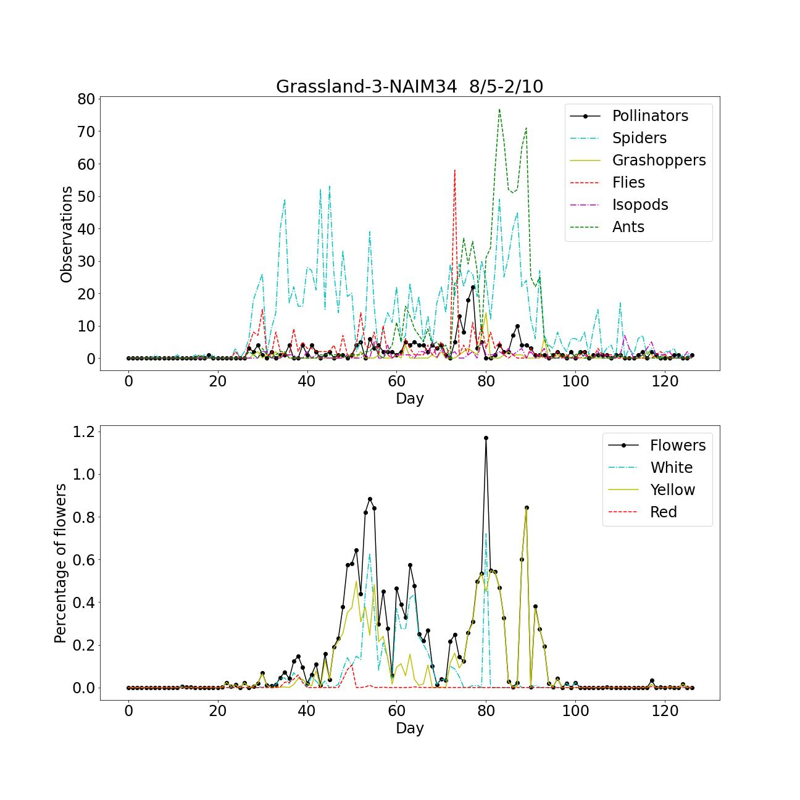

# Time-lapse monitoring of insects in floral environment #
This project contains Python code for processing time-lapse images from insect camera traps. (detection, classification and floral cover estimation)
The repository includes the essential Python code for the steps in the figure below. 
(The raw images from 48 camera recordings in 2020 and 2021 and training datasets are not included. 
 Only the result data (CSV, npy), source code (sh, py), trained models and weights (pt, h5) are available)

The work and results are described in the paper: "A deep learning pipeline for time-lapse camera monitoring of floral environments and insect populations".
https://www.biorxiv.org/content/10.1101/2024.04.12.589205v2.full

The detection of insects with motion-informed enhancement (MIE) is described and published in the paper: "Object Detection of Small Insects in Time-Lapse Camera Recordings".
https://www.mdpi.com/1424-8220/23/16/7242

## Python environment files ##
envreq.txt - environment requirements

condaInstall.sh - edit file to install conda environment on Linux

## Python source code files, configuration, models and scripts ##

Python npy files with sorted results of detections, filtering and arthropods classification (2020, 2021) must be downloaded unzipped and copied to the subfolder python.
https://drive.google.com/file/d/1EGbX-dmutI_xtKIyZWJpk2WujLaUkAzL/view?usp=drive_link
 
### Getting started ###

1. Download, unzip and copy the python npy files to the subfolder python as described above
  
2. Install the environment requirements condaInstall.sh (Linux with Anaconda)

3. Activate python environment

   - Anaconda: $ conda activate PyTorch_NI2
  
4. Run the python code to test and plot the abundance of arthropods and flower cover estimates
   (In the file it is possible to select year 2020 or 2021, detections with and without MIE, arthropods to plot)

   - python python/FlowerAndInsectsSortedShowPlots.py
 

# Estimate of flower content #

## Flower cover estimation based on combined sematic and color segmentation ##

python/weightsFlowers30NormBackRedV2b.pt - must be downloaded from:
https://drive.google.com/file/d/19i4MMh93nejticiBtAeFsNw4vEqgrFyy/view?usp=drive_link

python/FlowerCombinedSegmentationShowImages.py - Combines semantic segmentation and colors to estimate flower cover, plotting flower cover for each camera.
(The output will be the "Sorted_images_20xx.npy" and the "FlowersInImages_combined_20xx_1200_new.npy" when analyseImages=True see code.)

### Training flower semantic segmentation model ###

DeepLabv3/TrainFlowers.sh - Trains flower sematic segmenation DeepLabv3 model based on datasets/Flowers

# Classified arthropods in taxonomic ranks #

## Training and testing insect detector model ##

### YOLOv5 for arthropods detection and localization

The modified YOLOv5 code is an older version of the repository from: https://github.com/ultralytics/yolov5

### YOLOv5 object detector files ###
yolov5/data - YOLO configuration yaml files

yolov5/models - YOLO yaml models and code

yolov5/utils - YOLO source code with modification for motion-informed enhancement (MIE)

### Training YOLOv5 insect detector ###
yolov5/trainF1.py

yolov5/trainInsectsNI-I21.sh - train insect detector based on datasets/Insects

yolov5/trainInsectsNI-I21m.sh (MIE)

### Validate YOLOv5 insect detector ###
yolov5/val.py

yolov5/testInsectsNI-I21.sh

yolov5/testInsectsNI-I21.sh (MIE)

## Detecting arthropods in a time-lapse image sequence (MIE) ##

The YOLOv5 weights for the detection of arthropods trained with motion-informed enhancement or without can be downloaded from:
https://drive.google.com/file/d/1u7z4GABrNtTRoBkaxhdeu5D4K50Bqaqu/view?usp=drive_link

yolov5/insectsNI21-bestF1-1280m6.pt - YOLOv5m6 medium model trained to detect arthropods

yolov5/insectsNI21m-bestF1-1280m6.pt - YOLOv5s6 medium model trained to detect arthropods with MIE

yolov5/detectCSVNI2v2.py

yolov5/detectCSVNI2v2m.py (MIE)

yolov5/detectNI21v2m.sh

yolov5/detectNI21v2m.sh (MIE) 

Content of *.csv files which contain lines for each detection (YYYYMMDD.csv):

	year,camera,date,time,confidence,detectId,x1,y1,x2,y2,fileName

## Filtering YOLOv5 detections and classify arthropods in 19 classes ##

python/filterAndClassifyInsects19ClsMIE.py - Used images and YOLOv5 CSV files to filer detections and classify arthropods in 19 classes

Content of *.csv files which contain lines for each detection (YYYYMMDD.csv):

	year,camera,date,time,confidence,detectId,x1,y1,x2,y2,fileName

where the detectId will be updated with the following classification codes:

-2 - No movement, detection in the same position of the image sequence   
-1 - Match filered, NSSD is below threshold   
0 - Ladybirds   
1 - Beetles   
2 - Plants   
3 - Bumblebees   
4 - Hoverflies   
5 - Butterflies   
6 - Spiders   
7 - Ants   
8 - Flies   
9 - True bugs   
10 - Isopods   
11 - Unspecified   
12 - Hymenoptera   
13 - Grasshoppers   
14 - R. fulva   
15 - Satyrines   
16 - Small Tortoiseshell   
17 - Dragonflies   
18 - Honeybees

## Training and validation of arthropod classifier ##

python/training-ClassificationNetTest19Cls.py - Possible to train ResNetv50 and EfficientNetB4 based on datasets/NI2-19cls

python/test-ClassificatonNetTest19Cls.py - Validating trained models

# Plotting results for monitoring in 2020 and 2021 #

FlowerAndInsectsSortedShowPlots.py - Plotting results for the 19 classes of arthropods and flower cover estimates based on time-lapse recordings in 2020 and 2021.
Plots saved to Data_20xx_PlotsFlowersMixed_Habitat.
